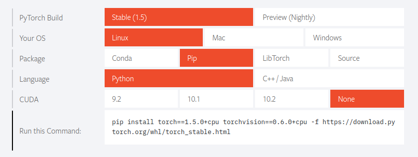

# Creative GAN
Generate Designs
# Running the app locally


Clone the repository and cd into it: 
```
git clone https://github.com/martinoywa/creative-gan.git
cd creative-gan
```
Install pipenv and requirements (PyTorch will be installed separately): 
```
pip install pipenv
pipenv install -r requirements.txt --skip-lock
```

Activate the virtual environment: 
```
pipenv shell
```

Install PyTorch (torch and torchvision): 
[Pytorch Quick Start Locally](https://pytorch.org/) <br/>
E.g for Linux

Always set `CUDA` to None if you don't have NVIDIA GPU with CUDA support.

Start Flask server and open local host on your browser: 
```
python app.py
```
